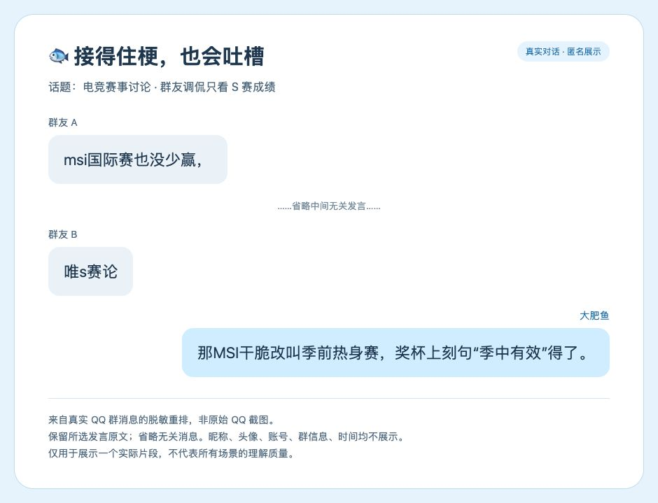

<div align="center">


# 大肥鱼 · Da Fei Yu 🐟

**DeepSeek 驱动的二次元 AI 聊天伙伴，让群聊多一点有趣的回应。**

QQ 可用 · 微信测试中 · macOS 原生 / Windows WSL2 本机 Web 面板 · 持续更新、完善与迭代中

[Mac 快速开始](docs/QUICKSTART.md) · [Windows 安装](docs/WINDOWS.md) · [真实案例](docs/CASES.md) · [操作指南](docs/USER_GUIDE.md) · [全部命令](docs/COMMANDS.md) · [架构与开发](docs/ARCHITECTURE.md) · [问题反馈](https://github.com/SAKURAfan1023/dafeiyu-bot/issues)

</div>

大肥鱼是一个独立、非官方的成年蓝色鲸鱼娘 AI 角色。以 **DeepSeek** 为对话核心，通过 **NapCat + OneBot 11** 接入 QQ，支持独立会话记忆、十种性格、短句聊天、表情包、引用理解、图片/GIF 观察、联网检索、主备生图，以及 Pixiv 搜图与定时分享。

> **项目状态：持续更新、完善与迭代中。** QQ 私聊与群真实 @ 回复已有真人接收确认，可用于个人测试和部署；不代表所有新功能、所有账号或连续运行时长均已验收。微信适配仍在测试，尚未完成可靠自动回复验收，请勿按成熟功能使用。macOS 提供原生界面，Windows 提供 WSL2 + 本机 Web 面板部署方式（Linux 自动化验证通过，Windows 实机待验收，见验证记录）；QQ 桥接可在独立 Linux 环境运行。当前没有 Windows 原生 exe 安装包。

## 能做什么

| 能力 | 用法 / 说明 |
| --- | --- |
| 💬 QQ 自动回复 | 指定好友 / 群白名单；群真实 @；可选每 N 条普通消息评估一次加入话题 |
| 🎭 十种性格 | 雌小鬼、温柔、傲娇、元气、理性、管家、猫娘、贴吧、抽象、戏精；每群、每好友独立 |
| 🧠 上下文与记忆 | 主人 / 机器人 / 好友角色分离；引用还原；按条数、长度或时间整理，按会话检索 |
| 🖼️ 图片与表情 | 图片/GIF 抽帧观察；按语境配图；本公开版自带四张原创 AI 示例表情，可扩充 |
| 🎨 生图与找图 | 智谱生图 + Cloudflare 备用；网页检索、网络图片；可选 Google Cloud Vision 查图来源 |
| 🧭 插画命令 | `/search` 统一关键词/ID搜图并自动保底、`/hot` 日榜、`/next` 续图；命令不调用大模型 |
| ⏰ 定时分享 | 每日或每小时一张，附作者、来源和继续命令，沿用会话范围、额度和去重 |
| 🛠️ 控制面板 | SwiftUI / 本机 Web；连接、启动、暂停、时限、队列、限额、密钥、记忆与工具配置 |

大肥鱼的短句不是“每秒生成一句”：默认正文上限 60 字，回复通常包含草稿和语义校对两次模型调用。思考、识图、记忆整理和联网都会影响延迟与费用，可按需要关闭。

图片发送记录保留一周；QQ 本机旧消息、媒体/日志与项目备份可定期清理，详见 [存储与清理规则](docs/STORAGE.md)。清理任务不调用大模型，保留登录配置和长期记忆。

## 看真实对话案例

**[打开案例专页 → 6 组真实私聊 / 群聊长图](docs/CASES.md)**：连续接话、性格命令、群 @ 与引用 GIF、生图回复、不确定性表达，以及一次识图失败。共 29 条消息、14 条已核对发送记录的机器人回复。图片来自真实附件；昵称与头像匿名化，聊天界面为重新排版，**非原始 QQ 截图**。

下面是早期电竞话题的简短片段；更多连续对话见案例专页。



来自实际 QQ 群的匿名片段，**脱敏重排，非原始 QQ 截图**。保留选中文本，省略无关发言；[取材方法与证据边界](docs/CHAT_EXAMPLE.md)。

## 五步开始

**Windows 用户先看 [Windows 完整安装教程](docs/WINDOWS.md)**；以下命令用于 Mac。

1. 准备 **macOS 14+、Swift 6 工具链、Python 3**，以及你自己的 **DeepSeek API Key**。
2. 按 [快速开始](docs/QUICKSTART.md) 准备 NapCat / QQ，开启带 Token 的 OneBot 11 正向 WebSocket，并完成扫码。
3. 克隆、测试并构建：

   ```sh
   git clone https://github.com/SAKURAfan1023/dafeiyu-bot.git
   cd dafeiyu-bot
   bash scripts/test.sh
   bash scripts/build.sh
   ```

4. 启动本机面板，打开终端输出的完整本机地址：

   ```sh
   'dist/WeChat AI Bot.app/Contents/MacOS/WeChatAIBot' --qq-control-panel
   ```

5. 填入你的机器人 QQ、OneBot Token、DeepSeek Key，连接后只启用明确允许的会话，先用“单次验收”。**连接成功不等于已经开始自动回复。**

密钥在本机面板配置；可使用钥匙串或仅本次运行凭证。仓库不提供任何可直接使用的账号、API Key、Token、登录二维码或原始私聊记录；案例页仅展示经作者筛选、匿名化的片段。**浏览器关闭不会停止后台**，结束时先点击暂停，终端前台运行可按 Ctrl+C 退出。

## 常用命令

```text
/persona list           查看十种性格
/persona 猫娘          切换当前会话
/persona 贴吧          切换贴吧吐槽风格
/persona default        恢复面板默认

/search 初音未来       关键词搜索，优先高收藏，无结果时保底
/hot                    从日榜前列按序获取
/search 53325959         作品 ID 直查，也支持 Pixiv 作品链接
/next                   沿用上次来源继续
/search help            查看完整帮助
```

命令仅对已启用会话生效，群内命令无需 @；群成员共享当前群性格。命令回执占发送额度，但不消耗模型调用、不计入普通群接话计数。编号仅用于菜单浏览，切换请使用名称。详细语法见 [命令表](docs/COMMANDS.md)。

## 认识大肥鱼

<div align="center">


</div>

以上为原创 AI 生成的项目示意素材，不是官方 DeepSeek 形象、真实聊天截图或第三方画师作品。大肥鱼可以俏皮、猫系、抽象或犀利；表达风格不应覆盖事实、主人识别与认真求助。公开版未打包私人运行环境的第三方表情收藏，详见 [素材与许可](THIRD_PARTY_NOTICES.md)。

## 状态、成本与已知边界

- **QQ 可用，持续迭代：** 已有基础私聊和群 @ 真实接收证据；其他功能需按自己的账号、模型、网络和素材再次验收。
- **微信测试中：** 原生窗口读取与控制仍属实验实现，群 @ 可靠关联和自动发送验收未完成。
- NapCat 是第三方 QQ 桥接，不是腾讯官方机器人接口；不能保证账号不会遇到风控，先用可接受风险的测试账号和小范围会话。
- DeepSeek Key 与聊天产品订阅不同；外部提供方可能计费或调整免费额度。仓库不承诺永久免费 API。
- 生图拒绝审核时不会通过换提示词或备用通道绕过；搜图只处理公开可访问作品，保留署名和来源。
- 每条命令不调用模型，不等于没有网络访问或发送额度消耗。图片、记忆和自动接话仍需按说明配置。

[安装排障](docs/QUICKSTART.md#排障) · [数据与安全](SECURITY.md) · [测试和证据边界](docs/VALIDATION.md)

## 反馈与参与

欢迎提交 [Bug Issue](https://github.com/SAKURAfan1023/dafeiyu-bot/issues/new?template=bug_report.yml)、功能建议和 Pull Request。反馈时提供版本、系统、复现步骤及脱敏错误；**不要上传密钥、完整控制地址、真实聊天、二维码或账号配置**。

有 Bug、使用问题或建议，可联系作者 **QQ：2807307652**，请备注“大肥鱼 / GitHub”。该号码仅为作者公开联系方式，不是默认机器人账号，也不会被加入运行白名单。安全问题请先私下联系，见 [SECURITY.md](SECURITY.md)。

**禁止恶意转载与滥用。** 转载或再分发请保留版权与许可声明，注明原仓库和修改内容；不得冒充作者/官方、夹带恶意代码、盗取密钥或泄露聊天及个人资料。本声明表达反滥用立场，不额外撤销 MIT 授予的合法转载、修改或商用权利。

代码使用 [MIT License](LICENSE)；原创示例图采用 [CC0 1.0](https://creativecommons.org/publicdomain/zero/1.0/)，第三方平台与工具遵循各自条款。见 [贡献指南](CONTRIBUTING.md)。

## 关键词 / Topics

中文：大肥鱼、DeepSeek、QQ机器人、QQ群机器人、AI聊天、二次元、鲸鱼娘、猫娘、角色扮演、性格切换、自动回复、NapCat、OneBot、会话记忆、长期记忆、上下文压缩、引用回复、表情包、GIF识别、图片理解、AI生图、搜图、Pixiv、画师、热门榜单、定时推送、Windows、WSL2、Linux、macOS、SwiftUI、本地面板、微信测试。

English: DeepSeek, QQ bot, AI chatbot, anime companion, virtual character, roleplay, persona, NapCat, OneBot 11, conversation memory, context summarization, multimodal, GIF vision, image generation, image search, Pixiv, scheduled messages, Windows, WSL2, Linux, macOS, Swift, SwiftUI, local control panel, experimental WeChat integration.
