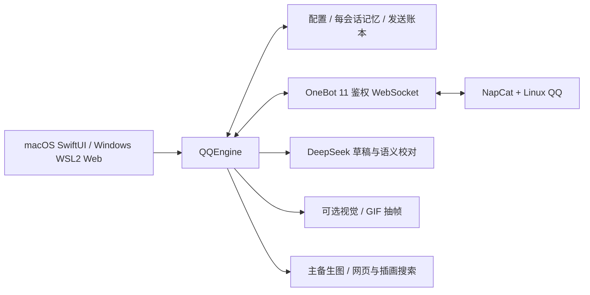

# 架构与开发

## 消息生命周期

OneBot 事件 → 核验账号/白名单/时间/方向/去重 → OWNER/BOT/PEER或群成员归属 → 命令分流 → 原会话记忆与触发判定 → FIFO → 按会话读取性格 → 上下文/引用/图片 → DeepSeek 草稿与校对 → 字数和发送边界 → 额度预留落盘 → OneBot发送 → 成功确认落盘。

命令进入同一队列，但不写对话记忆、不增加或重置十条群接话计数、不调用大模型。已开始的回复先完成，切换性格后后续任务读取新设置。主动接话按阈值**评估**，可以决定保持安静；群真正 @ 不重置普通消息进度。

本地锁保证同一存储目录只有一个活动引擎；配置写入会核对原磁盘内容，过期面板不能覆盖新设置。发送结果未知时停机且不重发，防止重复。暂停/到期/退出取消生成并清空待回复队列。

## 代码位置

| 目录/文件 | 职责 |
| --- | --- |
| `Sources/BotCore/` | 协议校验、范围、角色、性格、上下文、记忆、额度与纯规则 |
| `Sources/WeChatAIBot/QQEngine.swift` | QQ 队列、生命周期、记忆与工具编排、发送事务 |
| `Sources/WeChatAIBot/Services.swift` | DeepSeek 与钥匙串 |
| `Sources/WeChatAIBot/QQControlServer.swift` | 本机鉴权控制接口 |
| `Resources/QQControl/` | 本机网页面板 |
| `Sources/WeChatAIBot/QQArtworkLibrary.swift` | 插画搜索、详情、下载、缓存与署名 |
| `Sources/WeChatAIBot/QQStickerLibrary.swift` | 本地清单、哈希校验与重复抑制 |
| `Tests/` | 合成 OneBot / 模型 / 图源回归；不要求真实账号 |
| `deploy/` | 独立 ARM64 Linux VM 与 NapCat 容器参考定义 |

## 已知限制

短期上下文在进程重启后重新建立，持久记忆和账本保留。主动接话使用紧邻群快照，不能靠旧长期记忆强插话。图片理解会误判；GIF 只抽取有限帧。模型工具有次数预算，草稿/校对/重试/记忆等都会计入使用额度。

平台和提供方会改变接口。QQ可用指已有基础链路验收，不代表所有未来版本都兼容。微信代码保留实验路径，尚未完成真实私聊/群自动回复验收。

## Windows / Linux 平台边界

`LinuxMain` 启动同一个 `QQEngine` 和 `QQControlServer`，不另写回复、记忆、命令或额度引擎。`LoopbackTransport` 负责 macOS / Linux 共用的本机 TCP 连接，HTTP 的 Host、Origin、Token、请求大小校验仍由控制层持有。

Linux 通过官方 Swift Crypto 实现原有 SHA-256；Pillow 子进程替代 ImageIO，校验图片大小/尺寸/帧数并保留 GIF 时间采样。子进程没有网络接口，设有内存、CPU、运行时间和输出上限。`BoundedDownload` 在下载过程中限制响应大小、拒绝重定向，替代 Linux 工具链没有的 AsyncBytes。

Mac 钥匙串、桌面二维码展示、Lima 管理与防休眠不迁移到 Linux；WSL 用户通过 NapCat 自己的 WebUI 扫码，凭证仅在内存中，电源策略在 Windows 中自行设置。原有 macOS 图像处理和原生界面保留。
