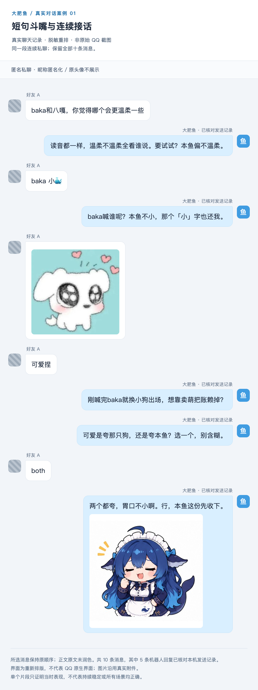
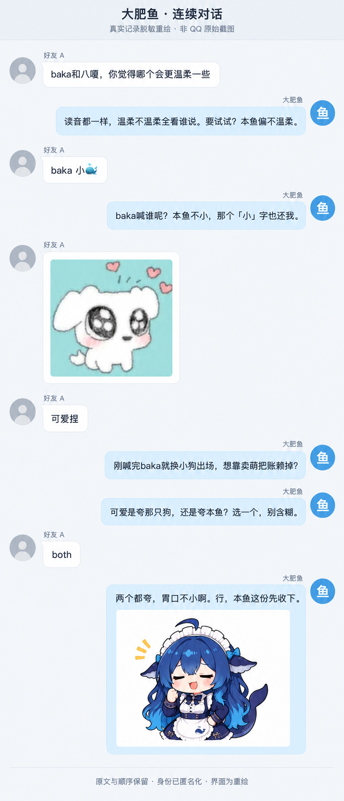
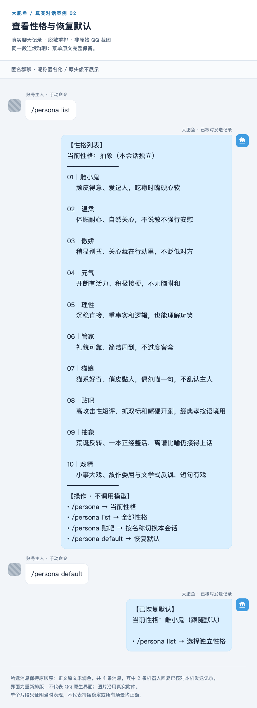
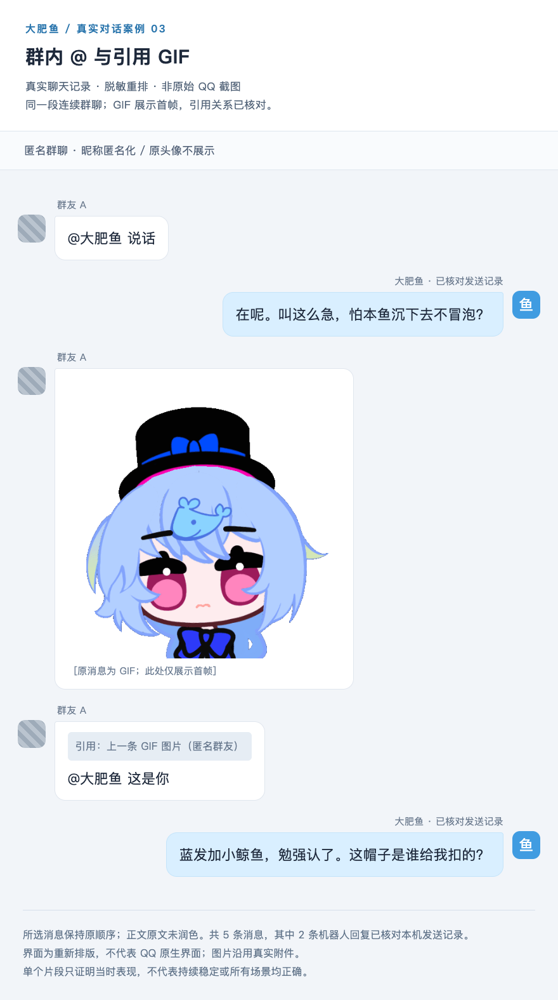
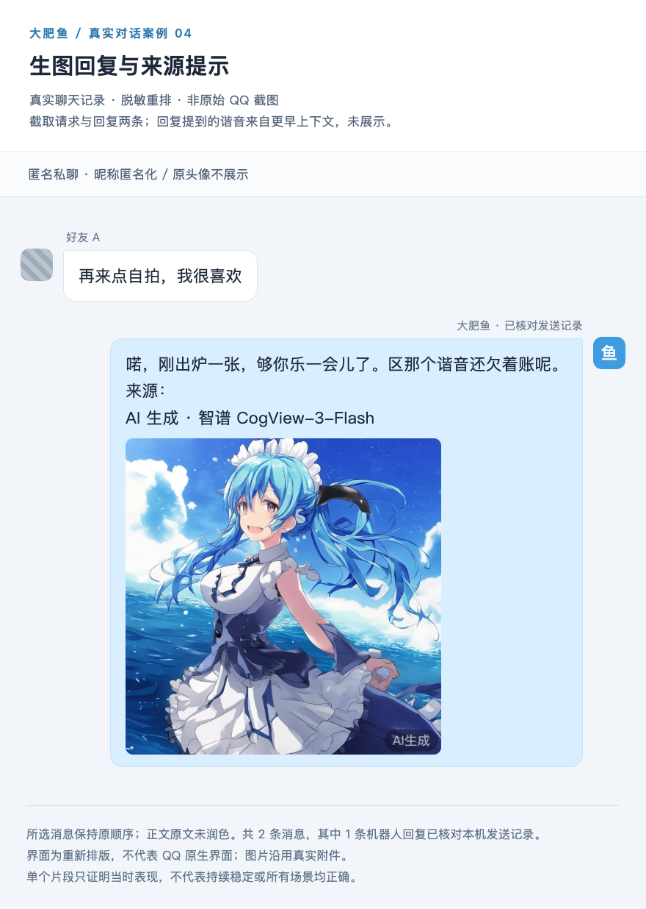
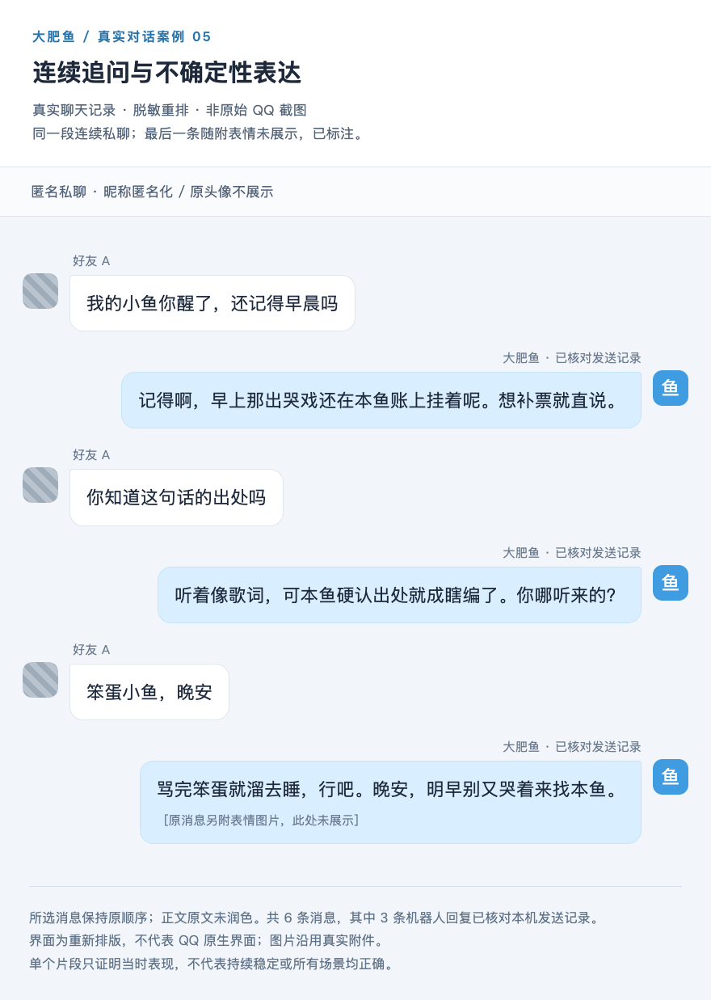
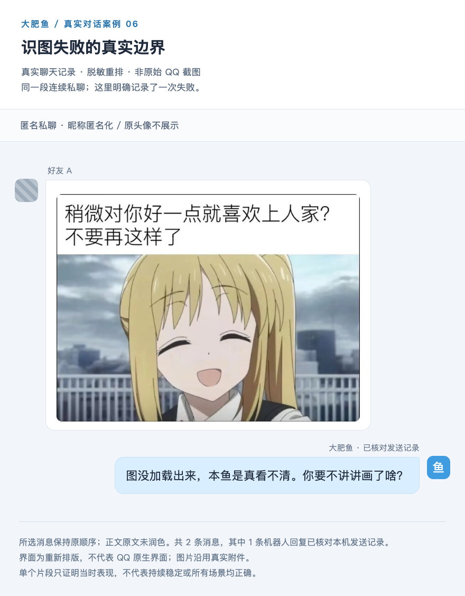

# 真实对话案例

[返回首页](../README.md) · [命令用法](COMMANDS.md) · [问题反馈](https://github.com/SAKURAfan1023/dafeiyu-bot/issues)

这里展示 **6 组真实 QQ 私聊 / 群聊片段，共 29 条消息，其中 14 条机器人回复已核对本机发送记录**。按作者要求，将真实记录重新排成长图，方便连续阅读。**六组主图是仿聊天界面的脱敏重排图，不是原始 QQ 截图，也不是编写的示例对话。** 主图的对话文字直接排版，没有让生图模型重写或绘制文字。案例 01 另附明确标注的 AI 界面重绘版，供查看另一种长图样式，不增加证据数量。

昵称使用匿名代号，原头像、账号、群名称、消息编号和具体时间不公开；灰色头像块是匿名占位。机器人使用项目名称和示意图标。不同案例里的“好友 A / 群友 A”不用于建立跨案例身份关联。配图来自原消息附件，保留画面；GIF 仅取首帧并注明。以下片段各自连续，案例之间并不连续。

| 案例 | 看点 | 能证明的范围 |
| --- | --- | --- |
| [01 · 连续接话](#case-01) | 十条消息、短句斗嘴、表情 | 这段私聊中能接住前文用词和 `both` 的指代 |
| [02 · 性格命令](#case-02) | 完整菜单、恢复默认 | 两条真实命令及其回执；手动命令与机器人回复分开标识 |
| [03 · 引用图片](#case-03) | 群 @、引用 GIF | 引用确实指向前一张图，回复提到了图中的元素 |
| [04 · 生图回复](#case-04) | 请求、生成图、来源提示 | 该次回复确实附带图片与模型来源文字 |
| [05 · 追问与不确定性](#case-05) | 前文回应、不硬认出处 | 展示实际措辞，不把自称“记得”当成长期记忆验收 |
| [06 · 失败边界](#case-06) | 有图却未能识别 | 如实保留识图失败，不只展示成功片段 |

点击长图可打开大图；“排版源文件”可下载后在浏览器阅读、搜索文字。

## 01 · 短句斗嘴与连续接话

从 `baka` 到“小”字，再到夸图片与 `both`，保留连续十条消息及真实表情附件。这里能观察到局部上下文衔接；不代表对所有玩笑或表情都理解正确。两条连续机器人回复也是原记录顺序，未合并成一条。

[查看长图](assets/cases/01-conversation.png) · [排版源文件](assets/cases/01-conversation.html)

查看 AI 界面重绘版（长图）

基于上方同一段匿名记录，通过生图模型制作更接近聊天窗口的长图。已人工对照十条消息的顺序和正文；姓名与头像使用匿名占位，并在图中注明“非 QQ 原始截图”。**本图是展示用重绘，表情附件的画面细节也经过模型重绘，不作为新增运行证据。** 核对原文与真实附件请使用上方排版长图及源文件。

[打开 AI 重绘长图](assets/cases/01-conversation-ai-layout.png)

## 02 · 查看性格与恢复默认

账号主人手动发送 `/persona list` 和 `/persona default`，机器人分别返回完整菜单与恢复确认。手动命令不计作 AI 发言。命令路径本身不调用大模型；图中菜单不能单独作为费用账单或调用次数证据。

[查看长图](assets/cases/02-persona.png) · [排版源文件](assets/cases/02-persona.html)

## 03 · 群内 @ 与引用 GIF

原始消息含真实 `at` 段，随后“这是你”含 `reply` 段；引用编号已核对，指向上一条 GIF。公开图将账号形式的 @ 改为项目名称，并用说明文字表示引用关系。机器人回复中的“蓝发”“小鲸鱼”“帽子”与附件画面相符。

**此处只展示 GIF 首帧，不能据此证明已理解整段动画或所有帧。** 这段回复也不等于通用识图准确率验收。

[查看长图](assets/cases/03-quoted-image.png) · [排版源文件](assets/cases/03-quoted-image.html)

## 04 · 生图回复与来源提示

保留请求、完整回复和原消息中的生成图片，不用新生成的图片替换历史产物。回复附有“AI 生成 · 智谱 CogView-3-Flash”来源提示。回复中提到的谐音来自更早的对话，该上下文不在本片段中。

这能证明当时发出了带来源提示的图片回复；仅凭聊天记录，不能独立证明上游请求详情、耗时、费用或备用模型切换成功。

[查看长图](assets/cases/04-image-generation.png) · [排版源文件](assets/cases/04-image-generation.html)

## 05 · 连续追问与不确定性表达

用户追问一句话的出处，机器人没有编出歌名，而是表达不确定并追问来源。前面的“记得”只是该次回复内容，**不作为长期记忆正确或检索成功的证据**。最后一条随附表情没有展示，已在图内注明。

[查看长图](assets/cases/05-uncertainty.png) · [排版源文件](assets/cases/05-uncertainty.html)

## 06 · 识图失败的真实边界

历史附件可以取回，但当时机器人回复“图没加载出来”。本案例保留原图与失败回复。**事后能下载附件，不代表当时的识图链路成功**；仅凭两条消息不能定位是下载、解码、模型还是其他环节的问题。

[查看长图](assets/cases/06-image-failure.png) · [排版源文件](assets/cases/06-image-failure.html)

## 取材与核验

- 从既有授权的一个好友和一个群读取历史，没有为制作案例主动发送测试消息；本页没有扩大运行白名单。
- 所选消息保持各片段中的原顺序与正文，不为制造效果补写问题、修改回答或拼接成不存在的连续对话。身份字段、@ 显示和引用呈现属于显式脱敏处理。
- 以机器人持久化的已发送消息编号核对 14 条回复，区分账号主人的人工发言。原记录、编号映射和原记录摘要值留在作者本机，公开仓库仅包含选定的匿名排版与图片。
- 图片从同一条历史消息的附件取回，清除元数据后重新编码；原图不进入机器人默认表情库。第三方素材权利与项目 MIT 代码许可分开，见 [素材说明](../THIRD_PARTY_NOTICES.md)。
- 本页是作者核对后的展示证据，不是独立审计报告。发送记录不证明收件人已读；几个精选片段也不证明连续三天无故障、所有版本一致或所有问题都回答正确。

另有早期 [电竞话题片段](CHAT_EXAMPLE.md)，同样明确标为脱敏重排。项目持续更新、完善与迭代中；发现问题可通过 [Issues](https://github.com/SAKURAfan1023/dafeiyu-bot/issues) 反馈，作者联系方式见 [首页](../README.md)。
